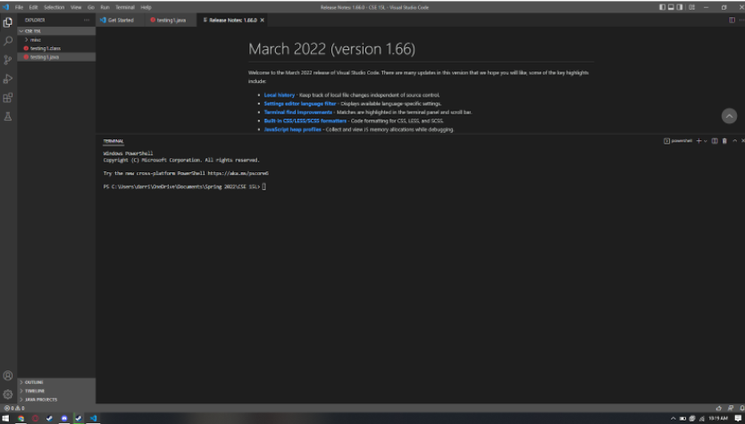
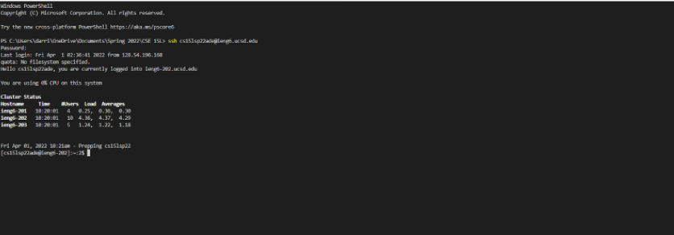
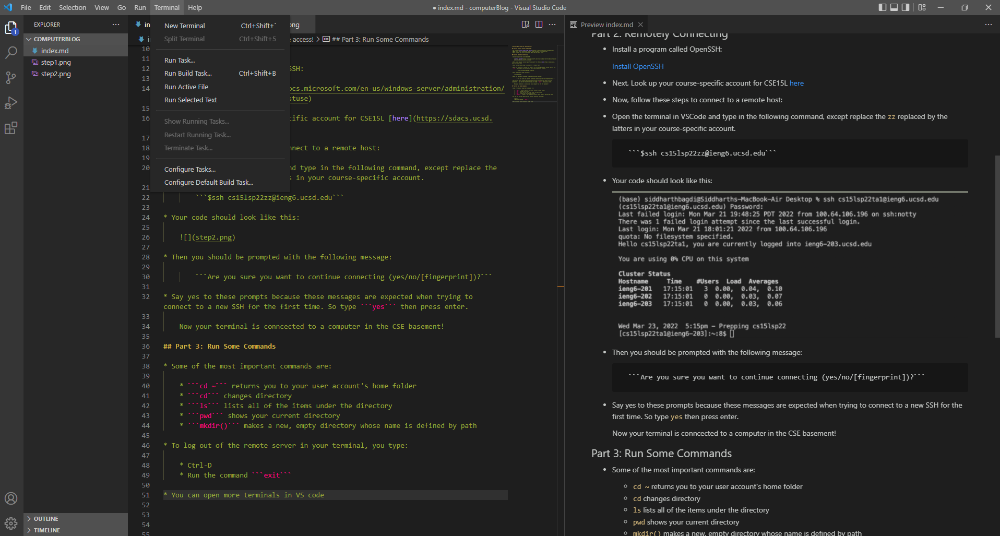
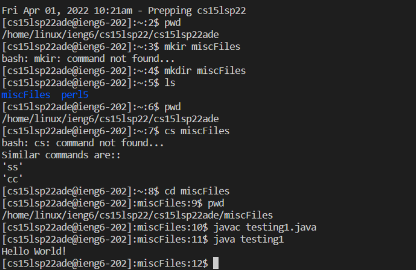
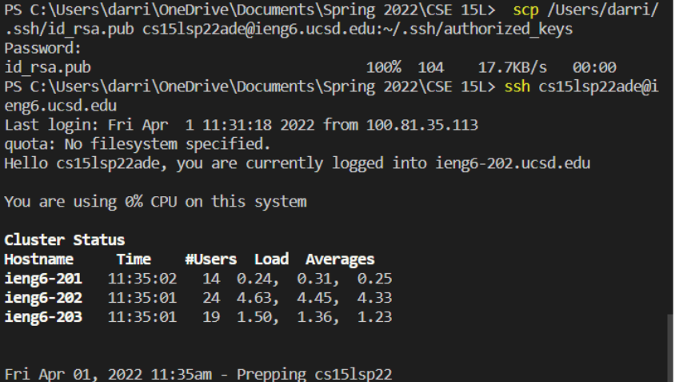
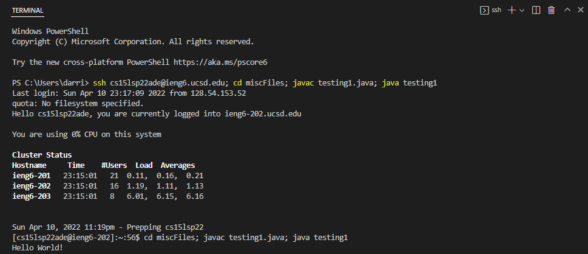

# CSE 15L Blog: How use remote access!

Hello! Welcome to CSE 15L. This is a tutorial on how to log into a course-specific account on ieng6.


## Part 1: Install Visual Studio Code

* Go to the [visual studio code website](https://code.visualstudio.com/download). 
* When it is fully installed, it will look like this: 
* This is what you will be using to edit code for this class

## Part 2: Remotely Connecting

* Install a program called OpenSSH:

    [Install OpenSSH](https://docs.microsoft.com/en-us/windows-server/administration/openssh/openssh_install_firstuse)

* Next, Look up your course-specific account for CSE15L [here](https://sdacs.ucsd.edu/~icc/index.php)

* Now, follow these steps to connect to a remote host:

* Open the terminal in VSCode and type in the following command, except replace the ```zz``` replaced by the latters in your course-specific account.

        ```$ssh cs15lsp22zz@ieng6.ucsd.edu```
    
* Your code should look like this:

    

* Then you should be prompted with the following message:
        
        ```Are you sure you want to continue connecting (yes/no/[fingerprint])?```

* Say yes to these prompts because these messages are expected when trying to connect to a new SSH for the first time. So type ```yes``` then press enter.

    Now your terminal is conncected to a computer in the CSE basement!

## Part 3: Run Some Commands

* Some of the most important commands are:

    * ```cd ~``` returns you to your user account's home folder
    * ```cd``` changes directory
    * ```ls``` lists all of the items under the directory
    * ```pwd``` shows your current directory
    * ```mkdir()``` makes a new, empty directory whose name is defined by path


* To log out of the remote server in your terminal, you type:

    * Ctrl-D
    * Run the command ```exit```

* You can open more terminals in VS code at this location (where it says new terminal):


## Part 4: Moving Files with SCP

* You can copy files back and forth between computers using the SCP command
* First, create a file on your computer called ```WhereAmI.java``` and put the following contents into it:
    
    ```
    class WhereAmI {
        public static void main(String[] args) {
            System.out.println(System.getProperty("os.name"));
            System.out.println(System.getProperty("user.name"));
            System.out.println(System.getProperty("user.home"));
            System.out.println(System.getProperty("user.dir"));
        }
    }
    ```
* Now, run this command (using your username): ```scp WhereAmI.java cs15lsp22zz@ieng6.ucsd.edu:~/```

* You can log into ieng6 with ssh and use ```ls```. Now you should see the file in your home directory. It should have looked something like this:


## Part 5: Setting up an SSH key

* On windows, type in the following command on client computer (personal computer): ```ssh-keygen -t ed25519```

* Then when it asks what file to save the key, enter the following: ```/Users/darri/.ssh/id_rsa```

* Next, when it prompts you to enter a passphrase, *do not* enter a passphrase. Just press enter to skip

* Now we need to copy the public key to the ```.ssh``` directory of your user account on the server

    * *after logging into the server type:*

        ```
        mkdir .ssh
        ```
    * Now logout, and on the client computer type the following command (using the information used in previous steps):
        ```
        /Users/<user-name>/.ssh/id_rsa.pub cs15lsp22zz@ieng6.ucsd.edu:~/.ssh/authorized_keys
        ```
* Now, you should be able to log into the server without needing to use a password. It should look something like this:
    

## Part 6: Optimizing remote running

* First, you need to copy down the command lines all into a sticky note/txt file:
```
ssh cs15lsp22ade@ieng6.ucsd.edu
cd miscFiles; javac testing1.java; java testing1
```
* Now, all you need to do is Ctrl-C/Ctrl-V and now you only neded to press 2 keys 2 different times to enter the server and run a java file

* It should look something like this:


* Now you're done! Congratulations!

    


