# Lab Report 4
## Sneaky Markdown Link Cases

For this lab report we are using our group's repo as well as our peer's repo. 

[Group's Repo]()
[Peer's Repo]()

## Snippet 1

For snippet 1 it is supposed to have the following output:

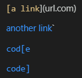

The first link would not format correctly, whereas the following 3 links count as valid URLs. They would correspond to “`google.com”, “google.com”, and “ucsd.edu”.

When I run it on my group's MarkdownParse.java file through a JUnit test:

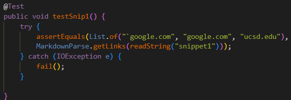

if we have the right implementation, we should see an identical output. However, we see:

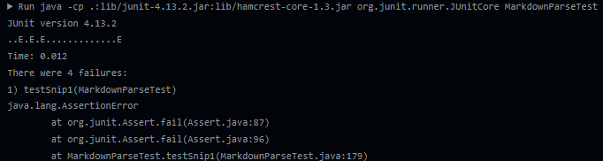

And when I run it through my peer's repo with the same test we also got: 

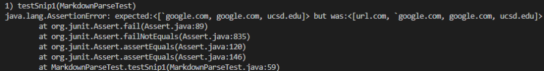

Both repos aren't suited to correctly identify the proper format for links in md.

### Question: Is there a short fix to this issue?

In order to account for these edge cases in our MarkdownParse files, I believe that this could be handled by changing around 10 lines of code. We can do this by adding an if statement checking for the backticks ( ` ) before the first open parenthesis. Then if the conditional statement is true, then we change the currentIndex to skip over it and check for the next open bracket.

## Snippet 2

Here is a preview of what snippet 2 is supposed to look like:

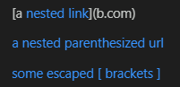

When running the following test in our group's repo:

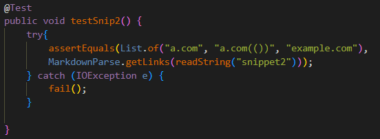

For my group's implementation we got the following error:

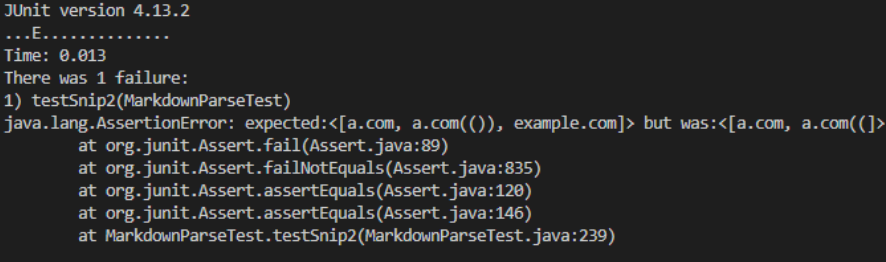

And for my peer's implementation, we got the following error:

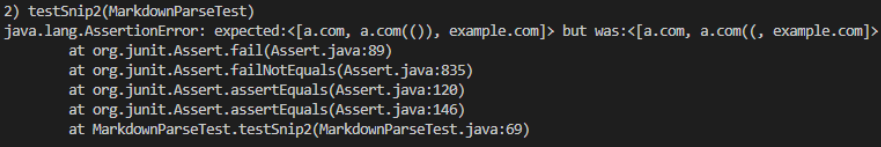

This means that both my group's and my peer's implementation were not suited for these edge cases for formatting links in markdown.

### Question: Is there a short fix to this issue?

I personally don't think that there is a short and simple change we can do to account for these edge cases. It would be difficult because we would have to check for nested parenthesis, which would ultimately require multiple loops. This is because we have to account for the possibility of multiple nested parenthesis within each other, meaning we would need to make sure that each open parenthesis has a matching closed parenthesis for the syntax to work out. And I believe that this would not be achievable in less than 10 lines/changes in code.

## Snippet 3

Here is a preview of what snipped 3 is suppsed to look like:

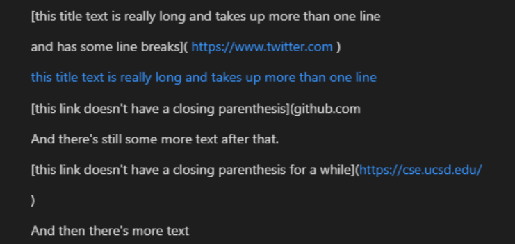

When we ran the following test:

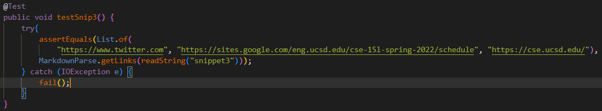

On our group's repo we get the following output:

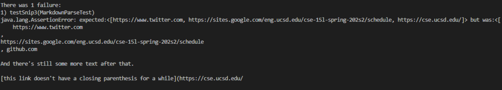

and when we run the same test on our peer's repo we get:

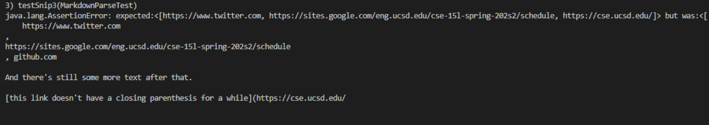

Thus, we can see that neither repo were suited to handle these edge cases.

### Question: Is there a short fix to this issue?

I believe that there would not be a short and easy fix for these edge cases. For the first link I believe that it would be achievable by changing 10 lines of code or less, however it is the 2nd and the 3rd links that present a challenge. First, the 2nd link would make us check if there is an open bracket inside the contents of the link. Then, we would have to make sure that the contents of the link is a valid link to a website. And furthermore, the problem is bigger because the (github.com...) website includes the text after it in our group's implementation. So with all of these edge cases to account for in this snippet, the change would require more than 10 lines of code.